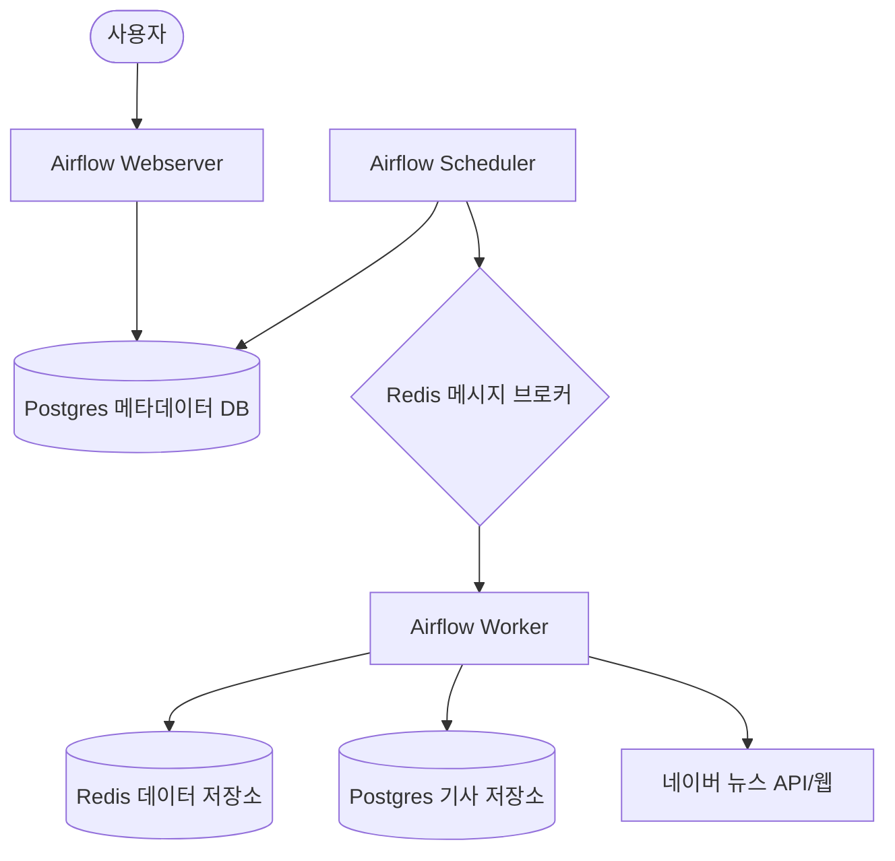

# 시스템 아키텍처 (System Architecture)

이 문서는 Airflow 및 Redis 기반 데이터 파이프라인의 고수준 아키텍처를 설명합니다.

## 개요 (Overview)

이 시스템은 컨테이너화된 환경에서 Apache Airflow를 사용하여 데이터 수집 및 처리 워크플로우를 관리합니다. 최근에 추가된 **네이버 뉴스 크롤러**는 이 인프라를 활용하여 대규모 뉴스 데이터를 수집하고 PostgreSQL에 저장합니다.

## 주요 구성 요소 (Components)

### 1. 워크플로우 관리 (Apache Airflow)
- **Webserver**: DAG 모니터링 및 관리를 위한 GUI를 제공합니다.
- **Scheduler**: DAG를 모니터링하고 실행 조건이 충족된 태스크를 트리거합니다.
- **Worker**: 태스크를 실제로 실행합니다. **CeleryExecutor**를 사용하여 워커를 수평적으로 확장할 수 있습니다.
- **Prisma Studio**: Docker 컨테이너로 실행되는 모던한 데이터베이스 GUI입니다. 별도의 인증 없이 로컬 환경에서 수집된 뉴스 데이터를 직관적으로 탐색하고 관리할 수 있습니다. (Port 5555)

### 2. 메시징 및 transient 저장소 (Redis)
- **Broker**: Celery의 메시지 브로커로 고용되어 스케줄러가 보낸 태스크를 워커로 전달합니다.
- **Data Store**: 일시적인 데이터 캐싱이나 파이프라인 단계 간 데이터 전달에 사용됩니다.

### 3. 메타데이터 및 서비스 데이터베이스 (Postgres)
- Airflow의 실행 상태(DAG, Run, Task 등)를 저장합니다.
- **네이버 뉴스 크롤러 데이터**: 수집된 기사 URL, 제목, 언론사 등의 정보가 동일한 Postgres 인스턴스의 `naver_news_articles` 테이블에 저장되어 영구적으로 보존됩니다.
- **영속성**: 로컬 디렉토리 `./postgres_data`와 연결(Bind Mount)되어 컨테이너가 삭제되어도 데이터가 유지됩니다.

## 데이터 흐름 (Data Flow)

1. **트리거**: 사용자가 Airflow UI에서 수동으로 또는 스케줄에 의해 DAG가 실행됩니다.
2. **뉴스 목록 수집**: 워커는 네이버 뉴스의 AJAX API를 호출하여 지정된 날짜/섹션의 기사 목록을 가져옵니다.
    - 이때 차단 방지를 위해 맥북 크롬 헤더와 랜덤 지연 시간을 적용합니다.
3. **상세 정보 추출**: 목록의 각 기사 URL을 방문하여 원본 기사 링크, 발행 시간, 언론사 이름을 추출합니다.
4. **저장**: 중복 확인(SHA256 해시 PK) 후 Postgres DB에 기사 정보를 저장합니다.
5. **상태 동기화**: 모든 태스크 실행 결과는 Postgres의 Airflow 메타데이터 영역에 기록됩니다.
