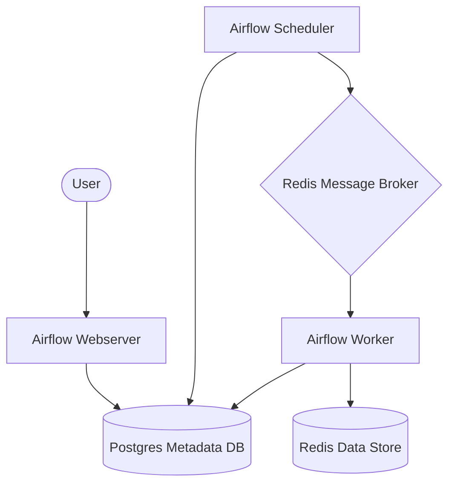

# System Architecture

This document describes the high-level architecture of the Airflow and Redis data pipeline.

## Overview

The pipeline is designed to be scalable and resilient, leveraging containerization and established open-source tools.

## Components

### 1. Orchestration (Apache Airflow)
- **Webserver**: Provides a GUI for monitoring and administration.
- **Scheduler**: Monitors DAGs and triggers tasks whose dependencies have been met.
- **Worker**: Executes tasks. In this setup, we use the **CeleryExecutor**, allowing for horizontal scaling of workers.

### 2. Messaging & Storage (Redis)
- **Broker**: Redis is used as the message broker for Celery, routing tasks from the scheduler to the workers.
- **Data Store**: In the example DAG, Redis is also used as a short-term data store/cache for passing data between pipeline steps or for final processing results.

### 3. Metadata Database (Postgres)
- Stores the state of DAGs, runs, tasks, and historical execution data.
- **Persistence**: PostgreSQL uses a **Bind Mount** to the local `./postgres_data` directory. This ensures that:
    - Data persists even if containers are destroyed.
    - Database files are directly accessible and manageable on the host machine (Mac).

## Data Flow
1. A DAG is triggered (manual or scheduled).
2. The Scheduler places tasks into the Redis queue.
3. Workers pull tasks from Redis and execute them.
4. During execution, workers can interact with the Redis Data Store to read/write transient data.
5. All execution states are synced back to the Postgres DB.
