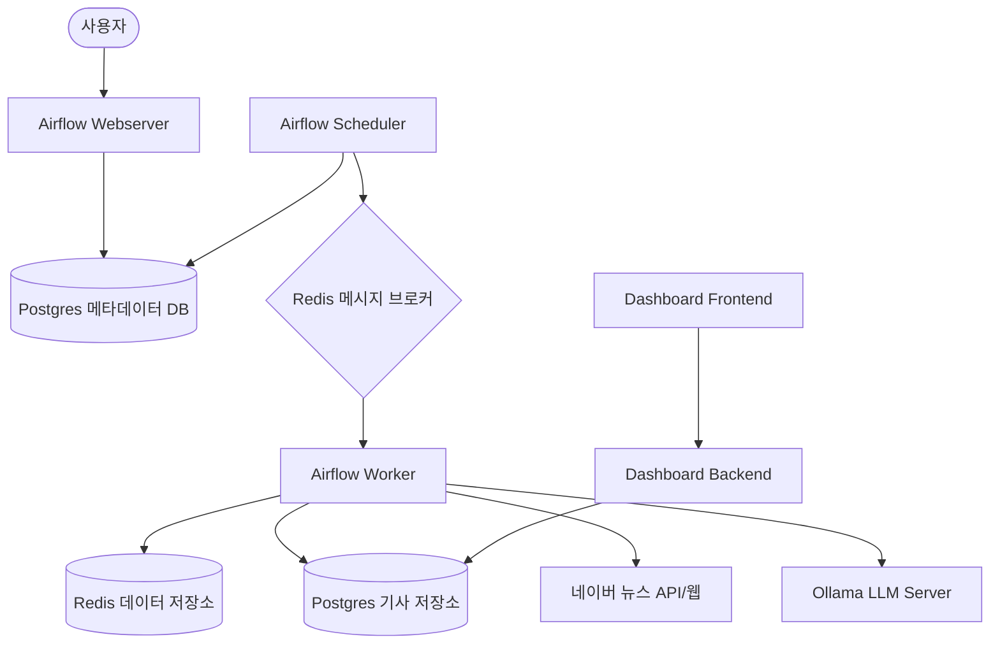

# 시스템 아키텍처 (System Architecture)

이 문서는 Airflow 및 Redis 기반 데이터 파이프라인의 고수준 아키텍처를 설명합니다.

## 개요 (Overview)

이 시스템은 컨테이너화된 환경에서 Apache Airflow를 사용하여 데이터 수집 및 처리 워크플로우를 관리합니다. 최근에 고도화된 **네이버 뉴스 크롤러**는 이 인프라를 활용하여 대규모 뉴스 데이터를 수집하고 PostgreSQL에 저장합니다. 크롤러는 **정기 수집(Scheduled)**과 **과거 데이터 수집(Backfill)** 두 가지 모드로 운영됩니다.

## 주요 구성 요소 (Components)

### 1. 워크플로우 관리 (Apache Airflow)
- **Webserver**: DAG 모니터링 및 관리를 위한 GUI를 제공합니다.
- **Scheduler**: DAG를 모니터링하고 실행 조건이 충족된 태스크를 트리거합니다.
- **Worker**: 태스크를 실제로 실행합니다. **CeleryExecutor**를 사용하여 워커를 수평적으로 확장할 수 있습니다. 
    - **커스텀 이미지**: 효율적인 본문 추출을 위해 `trafilatura` 및 관련 시스템 라이브러리(`libxml2`, `libxslt`, `zlib`)가 포함된 커스텀 `Dockerfile.airflow`를 사용합니다. 태스크 실행 시 별도의 패키지 설치 없이 즉시 동작합니다.
- **DAGs**:
    - `naver_news_crawler_scheduled`: 매시간 실행되어 오늘/어제 뉴스를 수집합니다.
    - `naver_news_crawler_backfill`: 사용자가 요청한 기간의 뉴스를 역순으로 수집합니다.
    - `naver_news_content_collector_dag`: 본문이 없는 기사의 내용을 채우는 수집기입니다. (수집 완료 시 요약 DAG를 즉시 트리거)
    - `naver_news_summarizer_dag`: 본문 수집이 완료된 기사를 **Ollama(Gemma 3)**를 통해 요약합니다. (실시간 트리거 및 연속 처리 지원)
- **Plugins**: `naver_news_crawler_utils.py`에 공통 크롤링 로직이 캡슐화되어 있어 유지보수성을 높였습니다.
- **Prisma Studio**: Docker 컨테이너로 실행되는 모던한 데이터베이스 GUI입니다. 별도의 인증 없이 로컬 환경에서 수집된 뉴스 데이터를 직관적으로 탐색하고 관리할 수 있습니다. (Port 5555)

### 2. 메시징 및 transient 저장소 (Redis)
- **Broker**: Celery의 메시지 브로커로 고용되어 스케줄러가 보낸 태스크를 워커로 전달합니다.
- **Data Store**: 일시적인 데이터 캐싱이나 파이프라인 단계 간 데이터 전달에 사용됩니다.

### 3. 메타데이터 및 서비스 데이터베이스 (Postgres)
- Airflow의 실행 상태(DAG, Run, Task 등)를 저장합니다.
- **네이버 뉴스 크롤러 데이터**: 수집된 기사 URL, 제목, 언론사 등의 정보가 동일한 Postgres 인스턴스의 `naver_news_articles` 테이블에 저장되어 영구적으로 보존됩니다.
- **영속성**: 로컬 디렉토리 `./postgres_data`와 연결(Bind Mount)되어 컨테이너가 삭제되어도 데이터가 유지됩니다.

### 4. 로컬 LLM 서버 (Ollama)
- **Ollama**: GPU 또는 CPU 리소스를 활용하여 전용 API 키 없이 로컬에서 대규모 언어 모델을 실행합니다. 이 프로젝트에서는 `gemma3:4b` 모델을 사용하여 기사 요약을 수행합니다.

### 5. 데이터 시각화 (Dashboard)
- **Dashboard Backend**: FastAPI 기반의 REST API 서버입니다. Postgres에서 뉴스 수집 통계를 조회하고, **실패한 수집 건을 초기화(Reset to PENDING)**하는 기능을 제공합니다. (Port 8000)
- **Dashboard Frontend**: React + Vite 기반의 웹 애플리케이션입니다. Chart.js를 사용하여 수집 트렌드, 언론사별/섹션별 통계를 시각화하며, **시계열 기준(수집일 vs 발행일) 전환** 기능과 실패한 기사를 일괄 재시도할 수 있는 리셋 버튼을 제공합니다. (Port 3000)

## 데이터 흐름 (Data Flow)

1. **트리거**:
    - **Scheduled**: 스케줄러가 매시간 자동으로 트리거합니다.
    - **Backfill**: 사용자가 Airflow UI에서 JSON 설정(`start_date`, `end_date`)과 함께 수동으로 트리거합니다.
2. **뉴스 목록 수집**: 워커는 `plugins`의 공통 로직을 사용하여 네이버 뉴스의 AJAX API를 호출합니다. 지정된 날짜/섹션의 기사 목록을 가져옵니다.
    - 이때 차단 방지를 위해 맥북 크롬 헤더와 랜덤 지연 시간을 적용합니다.
3. **상세 정보 추출**: 목록의 각 기사 URL을 방문하여 원본 기사 링크, 발행 시간, 언론사 이름을 추출합니다.
4. **저장**: 중복 확인(SHA256 해시 PK) 후 Postgres DB에 기사 정보를 저장합니다.
5. **본문 수집 (비동기)**:
    - 별도의 `content_collector` DAG가 주기적으로 실행됩니다.
    - **Locking**: `FOR UPDATE SKIP LOCKED` 쿼리로 처리되지 않은 기사들을 안전하게 가져옵니다.
    - **Trafilatura**: 기사 URL에 접속하여 본문과 부가 정보를 추출합니다.
    - **Update**: 추출된 본문을 원본 레코드에 업데이트하고 상태를 `COMPLETED`로 변경합니다.
6. **기사 요약 (비동기 & 실시간)**:
    - **자동 트리거**: `content_collector` 작업이 완료되는 즉시 `naver_news_summarizer_dag`가 호출됩니다.
    - **연속 수행**: 처리 대기 중인 모든 기사를 마칠 때까지 루프를 돌며 즉시 요약을 이어나갑니다.
    - **Ollama API**: 워커는 로컬 Ollama 서버에 본문을 전달하여 요약문을 생성합니다.
    - **저장**: 생성된 요약문과 모델 정보를 `summary`, `summary_model` 컬럼에 업데이트합니다.
7. **상태 동기화**: 모든 태스크 실행 결과는 Postgres의 Airflow 메타데이터 영역에 기록됩니다.
